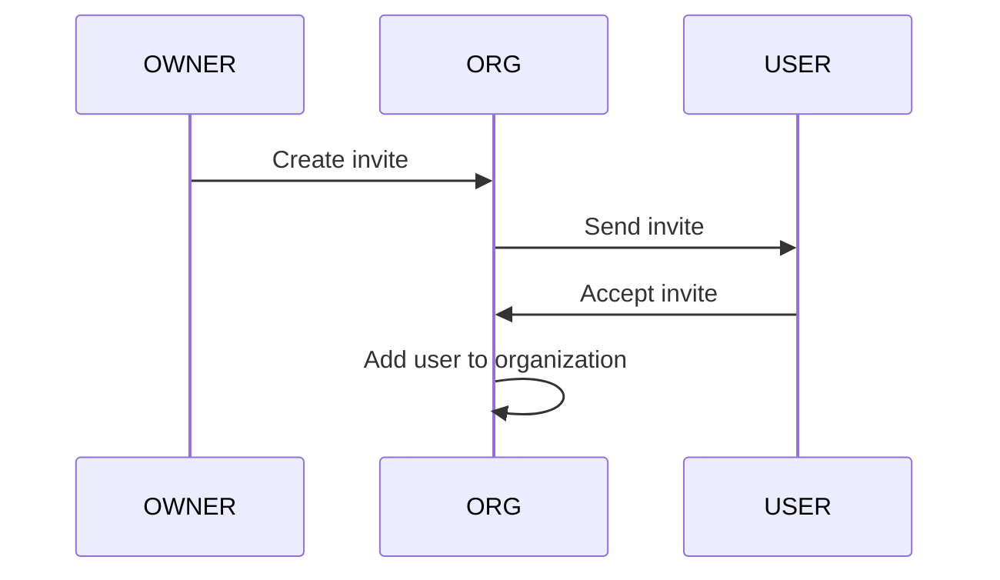

# Milestone: Organization Member CRUD

## Organization member management
- One should be able to RUD (retrieve, update, delete) members from the
  organization. (CREATE only via invite)
- Users may be members of multiple organizations.
- Users may be owners of multiple organizations.
- Users privileges are determined by their role in the organization.
- Users may be admins of multiple organizations.
- Users may be members of multiple organizations.
- Users may be owners of multiple organizations.
- A user may only have one role in an organization.

## GLOBAL Non-functional requirements:
- The organization roster should be accessible from the organization dashboard.
- It should take less than 3 seconds to load the organization roster page.
- The organization roster should work on desktop or laptop displays.

---

## As an Organization OWNER or ADMIN I want to CREATE Organization members so that I have collaborators.

**Functional requirements:**
- You cannot add users directly. They must be INVITED to join the organization.
- There is no CREATE operation for organization members.

---

## As an organization member I want to READ or LIST Organization members to see the full roster.

**Functional requirements:**
- All members of the organization may view the organization roster.
- NON-members may not view the organization roster.
- The organization roster should display the member's name, role, and status.
- The organization roster should NOT display the member's email address.
- Do not show inactive members in the organization roster.

**Non-functional requirements:**
- see global requirements

**Error Handling:**
- If the user is not logged in, then redirect to the login page.
- If the user is not a member of the organization, then return an error message.
- If the organization does not exist, then return an error message.
- If the organization is deleted, then return an error message.
- If the organization is soft-deleted, then return an error message.

---

## As an OWNER or ADMIN I want to UPDATE Organization member so that I can change their role or status.

**Functional requirements:**
- Owners and admins have permission to update members in the organization.
- Non-members may not update members in the organization.
- Soft-deleted organizations may not be updated.

**Non-functional requirements:**
- see global requirements

---

## As a USER I want to be able to LEAVE an organization.

**Functional requirements:**
- Members may remove themselves from the organization IF they are not the sole
  owner. Sole owners should transfer ownership to another member before leaving
  or DELETE the organization.
- USERS with role of MEMBER may not remove other members from the organization.
- OWNERs and ADMINs may remove non-OWNER members from the organization.

---

## DELETE Organization member
- OWNERs and ADMINs have permission to remove any member from the organization.
- OWNERs may not remove themselves from the organization if they are the only
  owner. (Suggest transferring ownership to another member.)
- ADMINs may remove other ADMINs and MEMBERs, but not OWNERs.
- MEMBERS may remove themselves from the organization.
- MEMBERS may not remove other members from the organization.
- Non-members may not remove members from the organization.

**Error handling:**
- If a sole-Owner tries to remove themselves from the organization, they
  should be prompted to transfer ownership to another member.
- If a non-admin tried to access a restricted page, then they should be
  redirected to the organization page with a 403 error django flash message.

---

# Diagrams

Creating a new organization member
1. OWNER/ADMIN creates organization invite
2. application send invite via email
3. user accepts invite
4. user is added to the organization

